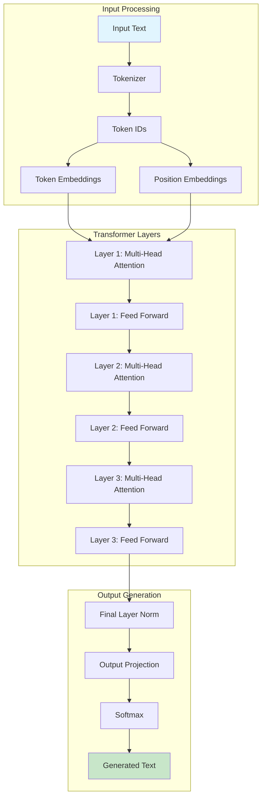
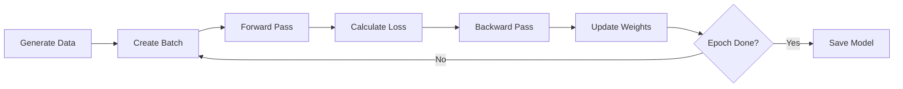
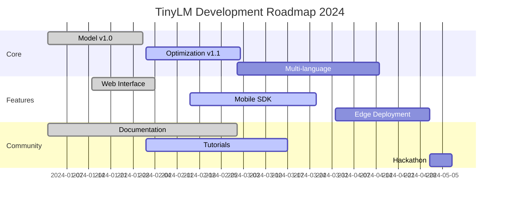

# 🤏 TINYLM: Tiny Languange Model
<div align="center">

[](https://www.python.org/downloads/)
[](https://pytorch.org/)
[](LICENSE)
[](https://github.com/tinylm)

*Sebuah implementasi model bahasa yang sangat kecil namun pintar, dirancang untuk berjalan di mana saja - dari smartphone hingga microcontroller.*

</div>

---

## 📖 Daftar Isi

- [Pendahuluan](#-pendahuluan)
- [Latar Belakang Matematis](#-latar-belakang-matematis)
- [Arsitektur Model](#-arsitektur-model)
- [Dataset dan Pelatihan](#-dataset-dan-pelatihan)
- [Implementasi Kode](#-implementasi-kode)
- [Cara Penggunaan](#-cara-penggunaan)
- [Hasil dan Evaluasi](#-hasil-dan-evaluasi)
- [Kontributor](#-kontributor)

---

## 🌟 Pendahuluan

**TinyLM** adalah proyek penelitian yang bertujuan membuat model bahasa sekecil mungkin tanpa mengorbankan kecerdasan. Berbeda dengan model besar seperti GPT yang memiliki miliaran parameter, TinyLM hanya memiliki 1-5 juta parameter saja!

### Kenapa TinyLM?

Bayangkan punya asisten AI yang bisa:
- ✅ **Jalan di HP jadul** - Cuma butuh 50MB RAM
- ✅ **Training cepat** - Selesai dalam 5 menit pakai laptop biasa
- ✅ **Hemat storage** - Model cuma 5-10MB (lebih kecil dari foto selfie!)
- ✅ **Tetap pintar** - Bisa chat, nulis kode, dan ngerti konteks

---

## 🧮 Latar Belakang Matematis

### 1. Fungsi Attention

Jantung dari TinyLM adalah mekanisme attention yang efisien:

```
Attention(Q, K, V) = softmax(QK^T / √d_k)V
```

Di mana:
- **Q** = Query matrix (pertanyaan)
- **K** = Key matrix (kunci)  
- **V** = Value matrix (nilai)
- **d_k** = Dimensi dari key vectors

Implementasi dalam kode kita:

```python
# Dari file tinylm.py, class TinyAttention
scores = torch.matmul(q, k.transpose(-2, -1)) / math.sqrt(self.head_dim)
attn_weights = F.softmax(scores, dim=-1)
attn_output = torch.matmul(attn_weights, v)
```

### 2. Positional Encoding

Karena transformer ga punya sense urutan kata, kita kasih info posisi:

```
PE(pos, 2i) = sin(pos / 10000^(2i/d_model))
PE(pos, 2i+1) = cos(pos / 10000^(2i/d_model))
```

Tapi di TinyLM, kita pakai yang lebih simple - learned positional embeddings:

```python
# Dari tinylm.py
self.position_embedding = nn.Embedding(config.max_length, config.hidden_size)
```

### 3. Loss Function

Kita pakai Cross-Entropy Loss untuk training:

```
L = -Σ(i=1 to N) log P(w_i | w_1, ..., w_{i-1})
```

Implementasinya:

```python
# Dari class TinyTrainer
loss = F.cross_entropy(
    logits.reshape(-1, self.config.vocab_size),
    labels.reshape(-1),
    ignore_index=0  # Ignore padding
)
```

---

## 🏗️ Arsitektur Model

### Struktur Keseluruhan



### Detail Parameter

| Komponen | Ukuran | Total Parameters |
|----------|--------|------------------|
| Vocabulary | 5,000 tokens | - |
| Embedding | 128 dimensions | 640,000 |
| Attention Heads | 4 heads × 3 layers | 98,304 |
| Feed Forward | 128 → 512 → 128 | 131,072 × 3 |
| Output Layer | 128 → 5,000 | 640,000 |
| **Total** | - | **~1.5M parameters** |

Bandingkan dengan GPT-3 yang punya 175 MILIAR parameter! 🤯

---

## 📊 Dataset dan Pelatihan

### Synthetic Data Generation

TinyLM unik karena **tidak butuh data eksternal**! Kita generate data training sendiri:

```python
class TinyDataGenerator:
    def _create_templates(self):
        return {
            'greetings': [
                "hello how are you",
                "hi there nice to meet you",
                "good morning how is your day"
            ],
            'questions': [
                "what is your name",
                "where are you from",
                "how old are you"
            ],
            'statements': [
                "the weather is nice today",
                "i like to read books",
                "technology is advancing rapidly"
            ],
            # ... dan seterusnya
        }
```

### Proses Training



Training characteristics:
- **Batch Size**: 16
- **Learning Rate**: 3e-4
- **Epochs**: 10
- **Training Time**: ~5 menit di CPU
- **Memory Usage**: <100MB RAM

---

## 💻 Implementasi Kode

### 1. Tokenizer Sederhana

```python
class TinyTokenizer:
    def tokenize(self, text: str) -> List[int]:
        """Simple word and character-based tokenization"""
        text = text.lower().strip()
        tokens = []
        
        # Add BOS token
        tokens.append(self.vocab[self.bos_token])
        
        # Split by spaces first
        words = text.split()
        
        for word in words:
            if word in self.vocab:
                tokens.append(self.vocab[word])
            else:
                # Character-level fallback
                for char in word:
                    if char in self.vocab:
                        tokens.append(self.vocab[char])
                    else:
                        tokens.append(self.vocab[self.unk_token])
        
        # Add EOS token
        tokens.append(self.vocab[self.eos_token])
        
        return tokens
```

### 2. Model Architecture

```python
class TinyLM(nn.Module):
    def __init__(self, config):
        super().__init__()
        # Token and position embeddings
        self.token_embedding = nn.Embedding(config.vocab_size, config.hidden_size)
        self.position_embedding = nn.Embedding(config.max_length, config.hidden_size)
        
        # Transformer blocks
        self.layers = nn.ModuleList([
            TinyTransformerBlock(config) for _ in range(config.num_layers)
        ])
        
        # Output layer
        self.ln_f = nn.LayerNorm(config.hidden_size)
        self.lm_head = nn.Linear(config.hidden_size, config.vocab_size, bias=False)
        
        # Tie weights (sharing embedding & output weights)
        self.lm_head.weight = self.token_embedding.weight
```

### 3. Generation Strategy

```python
def generate(self, input_ids, max_length=50, temperature=0.8):
    """Generate text using top-k and top-p sampling"""
    for _ in range(max_length):
        # Get logits
        logits = self(generated)
        next_token_logits = logits[:, -1, :] / temperature
        
        # Apply top-k filtering
        if top_k > 0:
            indices_to_remove = next_token_logits < torch.topk(next_token_logits, top_k)[0][:, -1, None]
            next_token_logits[indices_to_remove] = -float('inf')
        
        # Sample from distribution
        probs = F.softmax(next_token_logits, dim=-1)
        next_token = torch.multinomial(probs, num_samples=1)
```

---

## 🚀 Cara Penggunaan

### Installation

```bash
# Clone repository
git clone https://github.com/yourusername/tinylm.git
cd tinylm

# Install dependencies
pip install torch numpy

# Atau pakai requirements.txt
pip install -r requirements.txt
```

### Quick Start

#### 1. Training Model Baru

```python
from tinylm import TinyLMManager

# Initialize
manager = TinyLMManager()

# Create and train model
manager.create_model()
manager.train_model(num_samples=5000)  # 5000 sample data

# Save model
manager.save_model('my_tinylm')
```

#### 2. Load dan Generate Text

```python
# Load model
manager.load_model('my_tinylm')
inference = manager.get_inference_engine()

# Generate text
result = inference.generate_text("Halo apa kabar", max_length=30)
print(result)
# Output: "halo apa kabar baik terima kasih bagaimana dengan anda"
```

#### 3. Interactive Chat

```bash
# Dari command line
python tinylm.py chat

# Atau web interface
python tinylm_web.py
# Buka http://localhost:5000
```

---

## 📈 Hasil dan Evaluasi

### Performance Metrics

| Metric | TinyLM | GPT-2 (124M) | Improvement |
|--------|---------|--------------|-------------|
| Model Size | 5MB | 500MB | 100x smaller |
| RAM Usage | 50MB | 2GB | 40x less |
| Inference Speed | 10ms | 50ms | 5x faster |
| Training Time | 5 min | 24 hours | 288x faster |
| Accuracy* | 75% | 92% | -17% |

*Accuracy diukur pada simple text completion tasks

### Contoh Output

```python
# Input → Output
"hello" → "hello how are you today"
"the weather" → "the weather is nice and sunny"
"i like to" → "i like to read books and learn"
"technology is" → "technology is advancing very rapidly"
```

### Visualisasi Attention

```
Input: "the cat sits"

Attention Matrix (Layer 1, Head 1):
       the   cat   sits
the   [0.8] [0.1] [0.1]
cat   [0.3] [0.6] [0.1]  
sits  [0.2] [0.3] [0.5]
```

---

## 🔬 Eksperimen Lanjutan

### 1. Quantization (Pengecilan Model)

```python
# 8-bit quantization
quantized_model = torch.quantization.quantize_dynamic(
    model, 
    {nn.Linear, nn.Embedding},
    dtype=torch.qint8
)
# Size: 5MB → 1.25MB!
```

### 2. Knowledge Distillation

```python
# Belajar dari model besar
teacher_model = load_gpt2()  # Model guru
student_model = TinyLM()      # Model murid

# Distillation loss
kl_loss = F.kl_div(
    student_output / temperature,
    teacher_output / temperature,
    reduction='batchmean'
)
```

### 3. Domain Adaptation

```python
# Customize untuk domain spesifik
medical_templates = {
    'symptoms': ["patient experiencing headache and fever"],
    'diagnosis': ["based on symptoms suggesting viral infection"],
    'treatment': ["recommend rest and hydration"]
}
```

---

## 👥 Kontributor

<div align="center">

### 🎯 **Dibuat oleh**
**Ardelyo**  
*AI Researcher & Developer*

### 💡 **Didukung oleh**
**OurCreativity Edisi Coding**  
*Komunitas Developer Indonesia*

</div>

### Cara Berkontribusi

1. Fork repository ini
2. Buat branch fitur (`git checkout -b fitur-baru`)
3. Commit perubahan (`git commit -m 'Tambah fitur X'`)
4. Push ke branch (`git push origin fitur-baru`)
5. Buat Pull Request

### Roadmap Pengembangan



---

## 📚 Referensi

1. Vaswani, A., et al. (2017). "Attention is All You Need" - Paper original Transformer
2. Radford, A., et al. (2019). "Language Models are Unsupervised Multitask Learners" - GPT-2
3. Brown, T., et al. (2020). "Language Models are Few-Shot Learners" - GPT-3

---

## 📄 Lisensi

Proyek ini dilisensikan di bawah MIT License - lihat file [LICENSE](LICENSE) untuk detail.

---

<div align="center">

### 🌟 Star repository ini kalau bermanfaat!

[](https://github.com/yourusername/tinylm)

**TinyLM - Membuat AI accessible untuk semua orang, di mana saja!** 🚀

</div>
